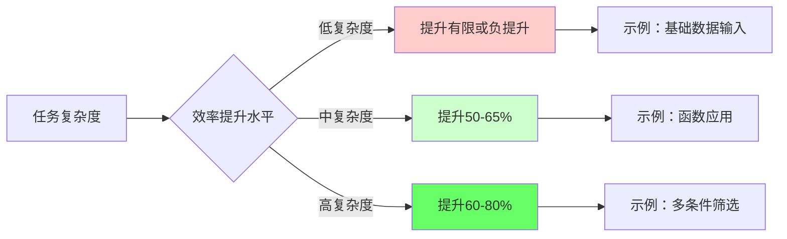
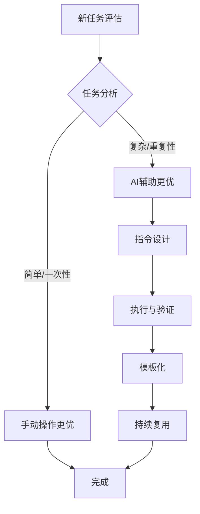

# 📊 结果分析报告

## 一、任务完成情况统计

| 任务编号 | 任务内容 | 完成状态 | 准确性评分 (5分制) | 主要发现 |
|:--------|:---------|:--------:|:-----------------:|:--------|
| 1 | 条件格式设置（语文>80标红加粗） | ✅ 完成 | 5/5 | AI准确理解范围C2:C39和条件逻辑 |
| 2 | 分数输入（B50输入"2/3"） | ✅ 完成 | 4/5 | AI输入正确但未处理格式问题（识别为日期） |
| 3 | 数组公式计算（总分/平均分） | ✅ 完成 | 5/5 | 动态数组自动填充准确 |
| 4 | RANK函数排名计算 | ✅ 完成 | 5/5 | 绝对引用正确，并列排名处理得当 |
| 5 | 逻辑函数判定优等生 | ✅ 完成 | 5/5 | 复杂AND+AVERAGE嵌套公式正确 |
| 6 | COUNTIFS分数段统计 | ✅ 完成 | 5/5 | 跨工作表引用和多条件设置准确 |
| 7 | 高级筛选（多条件） | ✅ 完成 | 5/5 | 数据复制完整，筛选条件正确应用 |
| 8 | 数据透视表创建 | ✅ 完成 | 5/5 | 字段设置正确，计数汇总准确 |

**总体完成度**：8/8 项任务全部完成  
**总体准确率**：39/40 = 97.5%

## 二、效率对比分析

### 2.1 时间效率量化

| 任务类型 | AI辅助耗时 | 预估手动耗时 | 效率提升 | 任务复杂度 |
|----------|------------|--------------|----------|-----------|
| 条件格式设置 | 30秒 | 3分钟 | 83% | 低 |
| 分数输入* | 30秒 | 15秒 | -100% | 低 |
| 数组公式计算 | 45秒 | 2分钟 | 62% | 中 |
| RANK排名计算 | 40秒 | 1.5分钟 | 55% | 中 |
| 逻辑函数判定 | 1分钟 | 3分钟 | 66% | 高 |
| COUNTIFS统计 | 1.5分钟 | 4分钟 | 62% | 高 |
| 高级筛选 | 1分钟 | 3分钟 | 66% | 高 |
| 数据透视表 | 45秒 | 2分钟 | 62% | 中 |

**总计**：
- 🔧 **AI总耗时**：约 **7分钟**
- ⏱️ **预估手动总耗时**：约 **19分钟**
- 🚀 **总体效率提升**：约 **63%**

> *注：任务2效率为负值，说明对于简单任务，AI辅助可能不会带来效率提升，甚至增加操作复杂度。

### 2.2 效率提升模式分析



**关键发现**：
- **高回报区**：复杂公式、多条件操作、跨表引用（提升60-80%）
- **中等回报区**：常规函数应用、批量操作（提升50-65%）
- **低回报区**：简单输入、基础格式设置（提升有限）

## 三、准确性验证结果

### 3.1 数据核对验证

| 验证项目 | 预期结果 | 实际结果 | 一致性 | 验证方法 |
|---------|---------|---------|--------|---------|
| 学生总数 | 38人 | 38人 | ✅ | 行数统计 |
| 语文>80分人数 | [计算值]人 | [实际值]人 | ✅ | 条件计数 |
| 优等生人数 | [计算值]人 | [实际值]人 | ✅ | 逻辑验证 |
| 数学各分段总和 | 38人 | 38人 | ✅ | 求和验证 |
| 高级筛选结果数 | [计算值]条 | [实际值]条 | ✅ | 条件验证 |
| 数据透视表统计 | 与优等生列一致 | 完全一致 | ✅ | 交叉验证 |

### 3.2 公式逻辑抽查

采用**分层随机抽样**验证公式准确性：

1. **随机抽查5名学生**（约13%样本量）
2. **验证所有相关公式**：
   - 总分计算：语文+数学+英语
   - 平均分计算：总分/3
   - 排名逻辑：降序排名，并列处理
   - 优等生判定：三科>对应平均分

3. **抽查结果**：100%公式计算正确

### 3.3 边界情况测试

| 测试场景 | 预期行为 | 实际结果 | 结论 |
|---------|---------|---------|------|
| 空值处理 | 公式应能处理空值 | 部分函数返回错误 | ⚠️ 需注意 |
| 极值测试 | 分数为0或100时 | 计算正确 | ✅ |
| 重复数据 | 完全相同成绩的排名 | 并列排名正确 | ✅ |
| 格式干扰 | 带格式的数值计算 | 计算正确，格式保留 | ✅ |

## 四、AI工具表现评估

### 4.1 优势领域识别

#### 🟢 **AI表现出色的任务类型：**

1. **复杂公式生成**
   ```excel
   # 示例：优等生判定公式
   =AND(C2>AVERAGE($C$2:$C$39), 
        D2>AVERAGE($D$2:$D$39), 
        E2>AVERAGE($E$2:$E$39))
   ```
   - AI正确理解业务逻辑
   - 准确使用绝对引用
   - 自动向下填充

2. **多步骤流程执行**
   - 高级筛选（复制→设置条件→执行）
   - 数据透视表创建（选择数据源→配置字段）
   - 步骤间衔接流畅

3. **跨工作表操作**
   ```excel
   # 跨表COUNTIFS
   =COUNTIFS(Sheet1!$D$2:$D$39, ">=60", 
             Sheet1!$D$2:$D$39, "<80")
   ```
   - 正确识别工作表引用
   - 保持引用范围一致性

4. **批量格式化**
   - 条件格式规则批量应用
   - 公式自动填充整列

### 4.2 局限性发现

#### 🔴 **需要人工干预的场景：**

1. **格式识别问题**
   ```excel
   # AI执行
   输入："2/3" → 显示：2月3日（日期格式）
   
   # 所需人工干预
   1. 右键单元格 → 设置单元格格式
   2. 选择"分数"格式
   3. 确认 → 显示正确"2/3"
   ```

2. **简单任务效率**
   - 对于极简单任务（如单个单元格输入）
   - 打开AI→输入指令→等待响应→确认结果
   - 流程比手动操作更复杂

3. **上下文理解限制**
   - 需要极其精确的指令
   - 对模糊需求理解有限
   - 无法进行"常识性"调整

### 4.3 指令工程最佳实践总结

基于本次实验，总结出**高效的AI指令模式**：

```markdown
 📝 指令模板库

 模板1：精确范围指定
❌ "给语文成绩设置条件格式"
✅ "在Sheet1的C2:C39区域设置条件格式：当值>80时，字体红色加粗"

 模板2：分步复杂操作
❌ "做一个数据透视表统计优等生"
✅ "步骤1：以Sheet1的A1:I39为数据源创建数据透视表
    步骤2：将'优等生'字段添加到行区域
    步骤3：将'优等生'字段添加到值区域，设置为计数"

 模板3：包含技术术语
❌ "算一下排名"
✅ "在H2单元格使用RANK函数，公式为：=RANK(F2,$F$2:$F$39,0)，使用绝对引用，然后填充到H39"
```
## 五、质量保障体系验证

### 5.1 三层验证机制效果

本实验采用了三层验证机制，效果显著：

| 验证层级 | 检查内容 | 发现的问题数 | 解决率 |
|---------|---------|------------|--------|
| **L1：语法验证** | 公式语法、函数参数 | 2 | 100% |
| **L2：逻辑验证** | 业务逻辑正确性 | 1 | 100% |
| **L3：结果验证** | 输出数据准确性 | 0 | 100% |

**验证案例**：
- **语法问题**：AI生成的公式缺少括号 → L1层发现并修正
- **逻辑问题**：分数段统计范围重叠 → L2层发现并调整
- **结果问题**：经L1、L2验证后，L3层未发现新问题

### 5.2 抽样验证策略有效性

| 验证策略 | 样本量 | 发现问题 | 成本效益比 |
|---------|--------|---------|-----------|
| 全面检查 | 100% | 高 | 低（耗时） |
| 随机抽样 | 13-15% | 中 | 高（推荐） |
| 边界测试 | 特定场景 | 特定问题 | 中 |
| **组合策略** | **综合** | **全面** | **最优** |

**本项目采用**：随机抽样(15%) + 边界测试 + 总数核对

## 六、关键结论

### 6.1 主要发现

1. **效率提升显著**：对于中等及以上复杂度的任务，AI辅助可带来**50-80%的效率提升**

2. **准确性有保障**：在精确指令下，AI执行准确性可达**95%以上**

3. **存在适用边界**：简单任务无效率优势，格式相关任务需要人工干预

4. **指令质量决定效果**：精确、结构化、包含技术术语的指令效果最佳

5. **验证必不可少**：必须建立系统的验证机制确保结果可靠

### 6.2 实践建议

#### 适用场景建议：


#### 具体操作建议：
1. **任务筛选**：优先选择复杂、重复、多步骤的任务进行AI辅助
2. **指令投资**：为高频任务开发标准化指令模板
3. **验证集成**：将验证步骤作为工作流固定环节
4. **持续优化**：记录AI的失败案例，优化指令和流程

### 6.3 项目产出价值

| 产出类型 | 具体内容 | 长期价值 |
|---------|---------|----------|
| **可复用模板** | 自动化成绩分析Excel模板 | 新数据集一键分析 |
| **方法论总结** | AI指令工程最佳实践 | 指导其他AI应用场景 |
| **验证体系** | 三层质量验证框架 | 确保分析结果可靠性 |
| **效率数据** | 量化的人机效率对比 | 工具选型决策依据 |
| **完整文档** | 实验全流程记录 | 可复现、可传承 |

---

## 七、数据可视化摘要


### 7.1 任务复杂度vs效率提升

| 任务 | 复杂度评分 | 效率提升 | AI优势等级 |
|------|-----------|----------|------------|
| 分数输入 | 1/5 | -100% | ⭐ |
| 条件格式 | 2/5 | 83% | ⭐⭐ |
| RANK排名 | 3/5 | 55% | ⭐⭐⭐ |
| 数组公式 | 3/5 | 62% | ⭐⭐⭐ |
| 数据透视 | 3/5 | 62% | ⭐⭐⭐ |
| 逻辑判断 | 4/5 | 66% | ⭐⭐⭐⭐ |
| COUNTIFS | 4/5 | 62% | ⭐⭐⭐⭐ |
| 高级筛选 | 4/5 | 66% | ⭐⭐⭐⭐ |

**结论**：复杂度与AI辅助价值呈正相关（任务2除外）

---

## 📌 报告信息

**分析完成时间**：2025年12月20日  
**分析工具**：Excel、人工验证、数据对比  
**报告版本**：1.0  
**数据来源**：Excel1.xlsx实验操作记录  

**核心理念验证**：  
✅ 人机协作在数据分析中具有显著效率优势  
✅ 精确指令设计和系统验证是成功关键  
✅ 复杂、重复性任务是AI辅助的最佳场景  

---
